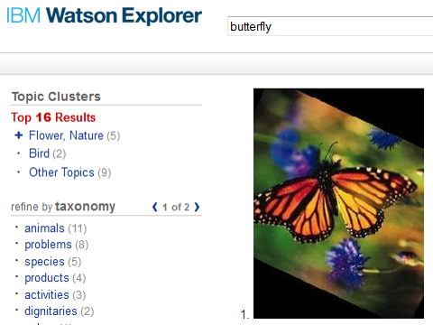

# Integrating the Watson Developer Cloud AlchemyAPI AlchemyVision Image Tagging Service with Watson Explorer

[IBM Watson Explorer](http://www.ibm.com/smarterplanet/us/en/ibmwatson/explorer.html) combines search and content analytics with unique cognitive computing capabilities available through external cloud services such as the [Watson Developer Cloud](http://www.ibm.com/smarterplanet/us/en/ibmwatson/developercloud/) to help users find and understand the information they need to work more efficiently and make better, more confident decisions.

The [Watson AlchemyVision](http://www.alchemyapi.com/products/alchemyvision) API employs deep learning innovations to understand a picture’s content and context. Organizations across a variety of industries — ranging from publishing and advertising to eCommerce and enterprise search — can effectively integrate images as part of big data analytics being used to make critical business decisions.

The AlchemyVision API sees complex visual scenes in their entirety — without needing any textual clues — leveraging a holistic approach to understanding the multiple objects and surroundings in common smartphone photos and online images.

This example uses the AlchemyAPI service available on Bluemix, which incorporates the AlchemyVision API. There are additional cognitive functions available via this service that will be covered in other integration examples.  The full AlchemyAPI reference is available on the [AlchemyAPI website](http://www.alchemyapi.com/api).

The goal of this tutorial is to demonstrate how to get started with an integration between Watson Explorer and the Watson AlchemyAPI service available on Bluemix, in the IBM Watson Developer Cloud. By the end of the tutorial you will have a modified Engine search collection that can send image data to a custom Bluemix Java application which uses the AlchemyAPI service for image analysis.  The Engine collection will store the AlchemyVision analysis results along with image thumbnails as search results.  Finally, you will modify an Engine display and your AppBuilder application to display the image thumbnail search results.



## Prerequisites
Please see the [Introduction](https://github.com/Watson-Explorer/wex-wdc-integration-samples) for an overview of the integration architecture, and the tools and libraries that need to be installed to create Java-based applications in Bluemix.

- An [IBM Bluemix](https://ace.ng.bluemix.net/) account
- [Watson Explorer](http://www.ibm.com/smarterplanet/us/en/ibmwatson/explorer.html) - Installed, configured, and running
- Some basic familiarity with Watson Explorer Engine and Watson Explorer Application Builder.  Completion of the Watson Explorer [Engine meta-data tutorial](http://www-01.ibm.com/support/knowledgecenter/SS8NLW_11.0.0/com.ibm.swg.im.infosphere.dataexpl.engine.tut.md.doc/c_vse-metadata-tutorial.html) and the Watson Explorer [AppBuilder tutorial](http://www.ibm.com/support/knowledgecenter/SS8NLW_11.0.0/com.ibm.swg.im.infosphere.dataexpl.appbuilder.doc/c_de-ab-devapp-tutorial.html) should be sufficient, but are not strictly necessary.
- An API key from the [AlchemyAPI website](https://www.alchemyapi.com/api/register.html)


## What's Included in this Tutorial

This tutorial will walk through the creation and deployment of four components.

1. A basic Bluemix application exposing the Watson AlchemyAPI service as a web service.
2. The ImageMagick® package.
3. A Watson Explorer Engine image converter.  This converter uses ImageMagick® to produce a thumbnail, and then converts the thumbnail to VXML.
4. A Watson Explorer Engine AlchemyVision converter.  This converter sends an image to the Bluemix application, which in turn sends the image to the AlchemyVision service for analysis.  The converter takes the analysis response and converts it to VXML.

Simple modifications to the Engine and AppBuilder result display are also made to properly render image thumbnails as search results.


## Step-by-Step Tutorial

This section provides details on the steps required to create an AlchemyAPI service in Bluemix, deploy a basic Watson AlchemyVision application in Bluemix, install ImageMagick®, install the new image and AlchemyVision converters, and make changes to Engine and AppBuilder result displays.

### Creating the AlchemyAPI service and application in Bluemix

The Bluemix documentation can be found [here](https://www.ng.bluemix.net/docs/).

Navigate to the Bluemix dashboard and create a new application with Liberty for Java.

A new AlchemyAPI service must be created via the Bluemix web UI.  The AlchemyAPI service cannot be created via the command-line.  Navigate to the Bluemix dashboard and create a new AlchemyAPI service.  Notice that you are required to provide your AlchemyAPI key when the service is created.  Notice also that you must supply the name of the application you just created.  For the sake of the example, we have chosen to name the service `wex-AlchemyAPI`.  Notice that "user-provided" is the only available service plan for AlchemyAPI right now.

   
### Configuring and Deploying the Watson AlchemyAPI AlchemyVision Image Tagging application in Bluemix

Clone this Git repository, or download the zip, extract, and navigate to the repository directory on the command-line.

The example Bluemix application uses a `manifest.yml` file to specify the application name, services bindings, and basic application settings.  Using a manifest simplifies distribution and deployment of CloudFoundry applications.

* Modify the manifest.yml file to agree with the service name, application name, and host name of the service and application you created in the previous step.

If you have not done so already, sign in to Bluemix.

```
$> cf api api.ng.bluemix.net
...
$> cf login
```

Build the application web service using [Apache Maven](http://maven.apache.org/). Before performing this step, verify that you are in the `/bluemix` directory of this repository. This will generate a Java WAR called `wex-wdc-AlchemyVision-sample.war`.

```
$> mvn install
```


Finally, deploy the application to your space in the Bluemix cloud.  Subsequent pushes to Bluemix will overwrite the previous instances you have deployed.

```
$> cf push
```


Once the application has finished restarting, you can now view the route that was created for your application with `cf routes`.  The running application URL can be determined by combining the host and domain from the routes listing.  You can also find this information in the `manifest.yml` file.

### Installing ImageMagick®

[ImageMagick®](http://www.imagemagick.org/) is a software suite used to create, edit, compose, or convert images.  ImageMagick® is free software delivered as a ready-to-run binary distribution or as source code that you may use, copy, modify, and distribute in both open and proprietary applications.  It is distributed under the [Apache 2.0 license](http://www.imagemagick.org/script/license.php).

Navigate to the [ImageMagick® download page](http://www.imagemagick.org/script/binary-releases.php) and follow the instructions for your operating system to download and install ImageMagick®.  Linux users may find that an ImageMagick® package is already installed, or available from a package repository.

Once installation is complete, make a note of the location of the `convert` binary that is part of the ImageMagick® suite.  **Ensure that the path to ImageMagick® binaries is part of the path environment variable for your web server user**.  You will need this path information when you configure the converters in the next steps.

### Installing and Configuring the Engine Image Converter

With the default Engine configuration, only text is indexed, not images.  Images are either discarded during a crawl, or, at best, image metadata (like EXIF data) is extracted from the image file and indexed.

In fact, the default collection configuration contains a crawl filter and a converter filter that eliminates most image filetypes.  The first step to using the image converter is to allow image filetypes.

1. Create a new collection and navigate to the crawling configuration tab.  Click the **edit** button across from the "**Binary file extensions (filter)**" crawl condition.  Add the following in the **Extensions to keep** setting:

   ```
   *.jpg
   *.JPG
   *.jpeg
   *.JPEG
   *.png
   *.PNG
   *.tif
   *.TIF
   *.tiff
   *.TIFF
   *.gif
   *.GIF
   ```

    
   Note that ImageMagick® can handle many additional image types.  You may add wildcards to this list for any image type that ImageMagick® handles.
2. Now add a new crawl condition to properly identify these image types.  Click the **Add a new condition** button and select **Custom conditional settings**.  Add the same wildcard list above to the new crawl condition to apply the condition to all incoming image URLs.  Then open the **Retrieval and encodings** section and specify `image` as the **Default content type**.
   
3. The default collection configuration includes a list of **Text cache content types**.  If URL data, during conversion, ever becomes any of the listed content types, the data will be saved in a database.  This "cached" version of the data is made available at query time via the "cache" link in search results.  However, this cache feature does not make sense for image results.  Clear the list of **Text cache content types** in the **Converting** section of the **Crawling** tab.
4. The default collection configuration includes a binary extensions filter converter as well.  This is designed to eliminate indexing of images extracted from successfully crawled data.  For example, a zip file containing images will not be filtered by the crawl condition.  Let's allow these images by navigating to the converting tab and clicking **edit** across from the **Binary file extensions (filter)** converter.  Once again, paste the wildcard list from step 1 into the **Extensions to keep** setting and click **OK**.

The image converter in this repository leverages ImageMagick® to produce a thumbnail, which is then [base64](https://en.wikipedia.org/wiki/Base64) encoded and indexed.  Proper indexing attributes are used to ensure that the base64 data cannot match queries or go through clustering.  Continue with these steps to add the converter to Engine.

5. In Engine, create a new XML Element by ensuring you are on the **Configuration** tab of the admin tool and then clicking the "+" across from "XML" in the left menu.  The element and name can have any value.
6. Copy the entire contents of [function.vse-converter-image-to-vxml.xml](/engine/function.vse-converter-image-to-vxml.xml).
7. Paste the copied XML into the Engine XML text box, replacing all text that was previously there.
8. Save the converter configuration by clicking **OK**

Finally, navigate back to the converting tab of your collection and click **Add a new converter**.  The **Image to VXML** converter should now appear in the list of available converters.  Add the Image to VXML converter and in the **Location of ImageMagick "convert" executable** setting, specify the complete filepath.  On Windows this defaults to `C:/Program Files/ImageMagick/convert.exe`.  On Linux this defaults to `/usr/bin/convert`.

Other settings are provided in the Image to VXML converter which allow the administrator to make the trade-off between image quality and index size.


### Installing and Configuring the AlchemyVision Image Tagging Converter

At this point, you should be able to successfully crawl and index some image URLs.  Let's set up the AlchemyVision Image Tagging Converter to add some analysis to those indexed images.  The steps for adding this converter are similar to adding the image converter above.

1. In Engine, create a new XML Element by ensuring you are on the **Configuration** tab of the admin tool and then clicking the "+" across from "XML" in the left menu.  The element and name can have any value.
2. Copy the entire contents of [function.vse-converter-alchemyapi-alchemyvision-imagetag-bluemix.xml](/engine/function.vse-converter-alchemyapi-alchemyvision-imagetag-bluemix.xml).
3. Paste the copied XML into the Engine XML text box, replacing all text that was previously there.
4. Save the converter configuration by clicking **OK**.

Navigate back to the converting tab of your collection and click **Add a new converter**.  The **AlchemyAPI AlchemyVision Image Tag Bluemix Converter** converter should now appear in the list of available converters.  Add the AlchemyAPI AlchemyVision Image Tag Bluemix Converter converter and then configure it as follows:

5. Enable **Fork conversion processing**.  This triggers a parallel conversion pipeline.  The parallel conversion pipeline allows the input image to be processed by both the Image to VXML converter (which indexes an image) as well as the Image Tagging converter (which indexes tags and taxonomy metadata for an image).
6. Provide the endpoint of your Bluemix application in the **Bluemix application REST endpoint** setting.
7. Enable **Include low confidence tags**.  This setting allows the AlchemyVision service to generate more tags.  The converter uses the Alchemy tag confidence score to weight the tags in the index, so low confidence tags get a low weight.  It is useful to enable low confidence tags during testing so that you can observe more example tags.
8. In the **Location of ImageMagick "convert" executable** setting, specify the complete filepath.  On Windows this defaults to `C:/Program Files/ImageMagick/convert.exe`.  On Linux this defaults to `/usr/bin/convert`.
9. Optionally enable the knowledge graph.  At the cost of an additional AlchemyAPI transaction, this provides taxonomy data in the AlchemyAPI response.  This can be used to create a hierarchical faceting of images.

Ensure that the tagging converter appears first in your list of converters and that the image converter appears second.  This is necessary to ensure that the conversion pipeline is forked by the tagging converter before the image is processed by the image converter.

Try crawling some images.  Use **Test it** or a search to confirm that you are receiving and indexing image tags from Alchemy, and that you are indexing base64 image data.

### Configuring the Engine display for image results

If you have crawled a few images and search your collection now, you should see results with an **AlchemyAPI Image Tag** content as well as a content named **thumb** which contains the base64 encoded thumbnail.  A quick display change will cause your web browser to decode that base64 data into an image.

In Engine, create a new display and new project.  Configure your project to use your image collection and your new display.  Image results often contain more data than typical search results.  For this reason, you may want to configure your project to limit the number of results requested to 20 instead of 200, at least during this development phase.

1. Navigate to your new project's **Simple** tab and click **edit**.  Find **Number of results requested (total)**, change it to 20, and click **OK**.

Also, given the relatively small amount of text that will be indexed for image results (only tags), it is easy for image results to be determined to be duplicates.

2. Navigate to your source's **Form** tab and enable **Output all duplicated documents**.

Now navigate to your display and perform the following configuration.

3. First, we need to define and configure a new result field.  Navigate to the **Settings > Results > Fields** tab and click **add new**.
4. For **Field ID** enter `thumbnail`.  For **Content Name** enter `thumb`.  For **Value (Expression)** enter `{concat('')}`.  For **Output Action** select `none`.  Save.
5. Now we need to define and configure a custom document that uses the new result field.  Navigate to the **Settings > Results > Document** tab.  Across from **Groups: Custom Document**, click **add new**.
6. For **Result type** enter the name of your collection.  For **Title field** enter `thumbnail` (the ID of the new field we just created).  Save.

Now that your display is configured, search your new project.  Try a search for a tag that Alchemy returned for one of your images.  Image base64 data should be decoded and rendered as real images.  Be sure to consider which of the default result fields and features make sense for your new image results.

### Configuring the Application Builder display for image results

Now that image search is working in Engine, let's configure image search in AppBuilder.  (Note that AppBuilder results do not depend on Engine project or display configuration.  We configured Engine image results for demonstration purposes, not because it is a prerequisite for AppBuilder image results.)

1. Ensure ZooKeeper and AppBuidler services are started, and that the Engine instance containing your image collection is configured to be a backend in AppBuilder.
2. Create a new entity for image results. Specify your image collection as the data store.
3. Under **Search options**, make the entity searchable.  Enter **""** (*two double quotation marks*) for the **Title formula**.
4. Still under **Search options**, create a new field and drag it up to the **SHOWN** area.  Select **thumb** for the **Field name**.  Enter **""** (*two double quotation marks*) for the **Label formula**.  Enter `("").html_safe` for the **Value formula**.
5. Scroll to the bottom of the entity configuration and click **Save entity**.

Now that your image entity is configured, search your app.  Try a search for a tag that Alchemy returned for one of your images.  Image base64 data should be decoded and rendered as real images.  Be sure to consider which of the default result fields and features make sense for your new image results.

# Suggested Use Cases

- See the [AlchemyAPI AlchemyVision](http://www.alchemyapi.com/products/alchemyvision) site for image analysis use cases.
- Modify function **vse-converter-link-extraction-templates** (which is used by the **HTML to XML** converter to extract and enqueue links) to enqueue the URLs in `` tags.  Enqueue image URLs along with their "alt" text, caption, other surrounding text, etc., to provide more opportunity for query term matches.
- Use additional command line options to the ImageMagick® converter program to add a border to the indexed thumbnail, add a watermark to the indexed thumbnail, or other additional image processing.
- Create a new converter that intercepts all image data and enqueues it to a *different collection*.  This would allow you to create a separate image collection for any document collection.

# Implementation Considerations

- **Crawl Performance** - An image crawl can be expensive compared to a typical data crawl.  Image data is generally large, and it must be fetched from its source, converted to a thumbnail, sent to the AlchemyAPI service over the network, and analyzed by the AlchemyAPI service.
- **Query Performance** - Again, image data is generally large.  Image results may contain significantly more data than text results, which will impact performance.  Image thumbnail dimensions and color depth can be reduced via converter settings, but be aware that reducing size will also reduce quality.  It may also help to reduce the number of results requested via the Engine project setting.
- **Privacy and Security** - The AlchemyAPI AlchemyVision Image Tag converter makes a web request to the Bluemix application endpoint.  In this example, this call is made over an unencrypted and unauthenticated HTTP connection, but your Bluemix application can be modified to support better security.
- **Failures will happen** - All distributed systems are inherently unreliable and failures will inevitably occur when attempting to call out to Bluemix.  Consider how failures should be handled.
- **Data Preparation** - It is the responsibility of the caller to ensure that representative data is being sent to the AlchemyAPI AlchemyVision Image Tag API.  Additional data preparation may be required in some cases.  Choose content carefully.
- **Scalability** - This example uses only a single cloud instance with the default Bluemix application settings.  In a production scenario consider how much hardware will be required and adjust the Bluemix application settings accordingly.

## Caching Proxy
Given the considerations listed here, the use of a caching proxy is always recommended in a Production environment.  Using a caching proxy can speed up widget refreshes in some situations, overcome some network failures, and in some cases may also allow you to reduce the total number of required AlchemyAPI transactions.


# Licensing
All sample code contained within this project repository or any subdirectories is licensed according to the terms of the MIT license, which can be viewed in the file license.txt.


# Open Source @ IBM
[Find more open source projects on the IBM Github Page](http://ibm.github.io/)

    
